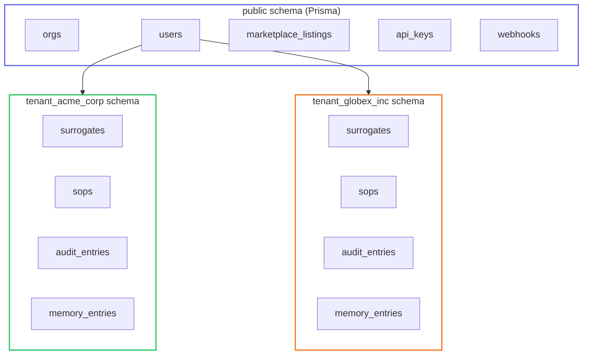
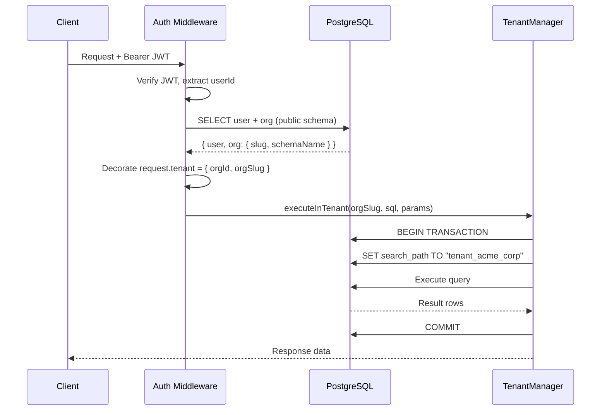

# Multi-Tenancy Deep Dive

Surrogate OS implements **schema-per-tenant** multi-tenancy in PostgreSQL. Every organization gets a dedicated database schema with full data isolation. This page explains the pattern, the `TenantManager` class, and how to extend tenant tables.

---

## Architecture Overview



### Two Data Tiers

| Tier | Schema | Managed By | Contains |
|------|--------|-----------|----------|
| **Platform** | `public` | Prisma migrations | Users, Orgs, Marketplace, API Keys, Webhooks, Federation, Notifications |
| **Tenant** | `tenant_{slug}` | TenantManager (raw SQL) | Surrogates, SOPs, Audit, Sessions, Memory, Debriefs, Proposals, Handoffs, Personas, Bias, Humanoid Devices, Executions, Compliance |

---

## Request Flow: JWT to Tenant Schema

Every authenticated request goes through this pipeline:



Key properties:
- `SET search_path` and the query run inside the **same transaction** to avoid connection pool issues
- Slug validation rejects any characters outside `[a-z0-9-]`
- Schema names convert hyphens to underscores: `acme-corp` becomes `tenant_acme_corp`

---

## TenantManager Class

The `TenantManager` (`apps/api/src/tenancy/tenant-manager.ts`) provides four core methods:

### `createTenantSchema(orgSlug)`

Called during org registration. Creates the schema and all tenant tables with indexes. Also enables the `pgvector` extension for embedding storage.

### `executeInTenant<T>(orgSlug, sql, params?)`

Executes a query that returns results (SELECT) within a tenant's schema. Uses `$transaction` to guarantee the `SET search_path` and query share the same database connection.

```typescript
const surrogates = await tenantManager.executeInTenant<Surrogate[]>(
  orgSlug,
  'SELECT * FROM surrogates WHERE status = $1',
  ['ACTIVE']
);
```

### `executeStatementInTenant(orgSlug, sql, params?)`

Executes a statement that returns an affected row count (INSERT, UPDATE, DELETE) within a tenant's schema.

### `getTenantConnection(orgSlug)`

Returns a scoped query function for cases where you need multiple queries within the same tenant context:

```typescript
const { query } = await tenantManager.getTenantConnection(orgSlug);
const surrogates = await query('SELECT * FROM surrogates');
const sops = await query('SELECT * FROM sops');
```

---

## Tenant Tables

Each tenant schema contains 15 tables:

| Table | Purpose |
|-------|---------|
| `surrogates` | AI agent definitions (role, domain, jurisdiction, config) |
| `sops` | Versioned SOP graphs with hash-chain integrity |
| `audit_entries` | Append-only audit log with cryptographic chaining |
| `sessions` | Surrogate work sessions |
| `decision_outcomes` | Per-session decision records |
| `debriefs` | Post-session analysis reports |
| `sop_proposals` | Proposed SOP modifications with review workflow |
| `org_documents` | Uploaded organizational documents |
| `document_chunks` | Document chunks with pgvector embeddings (1536 dimensions) |
| `memory_entries` | STM/LTM institutional memory entries |
| `handoffs` | D2D, D2H, H2D handoff records |
| `persona_templates` | Reusable persona definitions |
| `persona_versions` | Versioned persona configurations |
| `bias_checks` | Bias audit analysis results |
| `humanoid_devices` | Registered humanoid/device endpoints |
| `executions` | Real-time SOP execution state |
| `compliance_checks` | Regulatory compliance results |
| `sop_signatures` | Cryptographic SOP signatures (Ed25519) |

---

## Adding a New Tenant Table

To add a new table to the tenant schema:

1. **Add the CREATE TABLE statement** in `TenantManager.createTenantSchema()`:

```typescript
await this.prisma.$executeRawUnsafe(`
  CREATE TABLE IF NOT EXISTS "${schemaName}".my_new_table (
    id UUID PRIMARY KEY DEFAULT gen_random_uuid(),
    surrogate_id UUID REFERENCES "${schemaName}".surrogates(id),
    data JSONB NOT NULL DEFAULT '{}',
    created_at TIMESTAMPTZ DEFAULT now()
  )
`);
```

2. **Add indexes** for common query patterns:

```typescript
await this.prisma.$executeRawUnsafe(`
  CREATE INDEX IF NOT EXISTS idx_my_new_table_surrogate_id
    ON "${schemaName}".my_new_table(surrogate_id)
`);
```

3. **Create a service** that uses `executeInTenant` for all data access.

4. **Create routes** that extract `request.tenant!` and pass the org slug to the service.

> **Important**: Tenant tables are NOT managed by Prisma migrations. They are created via raw SQL in `createTenantSchema()`. If you modify the schema of an existing table, you need a migration strategy for existing tenants.

---

## Security Properties

- **Schema isolation**: Cross-tenant queries are architecturally impossible because `search_path` is set per-transaction
- **Slug validation**: Rejects SQL injection via strict regex: `/^[a-z0-9]+(-[a-z0-9]+)*$/`
- **No shared mutable state**: Each tenant's data lives in its own schema with independent indexes
- **Audit chain integrity**: Tenant audit entries use hash-chaining for tamper detection

---

*See also: [Platform Architecture](/docs/architecture/overview) | [API Endpoints](/docs/api/endpoints)*
