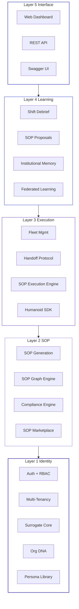
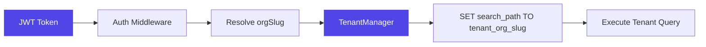
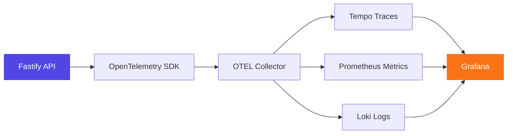

# Platform Architecture

Surrogate OS is a monorepo platform that synthesizes professional identities and deploys them as operational AI agents. This document covers the high-level architecture, layer model, and technology choices.

---

## Monorepo Structure

```
surrogate-os/
├── apps/
│   ├── api/            # Fastify v5 backend (port 3001)
│   ├── web/            # Next.js 15 dashboard (port 3000)
│   └── docs/           # Docusaurus documentation (port 3002)
├── packages/
│   ├── shared/         # Zod schemas, TypeScript types, constants
│   └── observability/  # OpenTelemetry tracing, Pino logging, metrics
├── infra/              # Docker Compose, OTEL config, Grafana provisioning
└── .github/            # CI/CD workflows
```

All packages are managed with **Turborepo** for build orchestration and caching.

---

## Five-Layer Stack

The platform is organized into five conceptual layers, each with distinct responsibilities:



| Layer | Purpose | Key Modules |
|-------|---------|-------------|
| **Identity** | Authentication, tenant isolation, surrogate definitions | Auth, Orgs, Surrogates, Org DNA, Personas |
| **SOP** | Procedure generation, graph structure, compliance | SOPs, LLM, Compliance, Marketplace |
| **Execution** | Real-time SOP traversal, fleet coordination | Executions, Fleet, Handoffs, Humanoid |
| **Learning** | Post-execution analysis, continuous improvement | Debriefs, Proposals, Memory, Federation |
| **Interface** | User-facing surfaces | Next.js Dashboard, REST API, Swagger |

---

## Multi-Tenant Architecture

Surrogate OS uses a **schema-per-tenant** pattern in PostgreSQL. Each organization gets its own isolated database schema, while shared platform data (users, orgs, marketplace listings) lives in the `public` schema managed by Prisma.



See [Multi-Tenancy Deep Dive](/docs/architecture/multi-tenancy) for implementation details.

---

## Tech Stack

### Application

| Component | Technology | Details |
|-----------|-----------|---------|
| **Backend** | Fastify v5 + TypeScript | Schema-validated HTTP, plugin architecture |
| **Frontend** | Next.js 15 (App Router) | React 19 + Tailwind CSS v4 |
| **ORM** | Prisma v6 | Public schema models, raw SQL for tenant schemas |
| **Auth** | JWT + bcrypt | Access tokens (15m) + Refresh tokens (7d) |
| **Validation** | Zod | Shared schemas across frontend and backend |
| **Build** | Turborepo | Monorepo orchestration with build cache |
| **LLM** | Claude / OpenAI / Ollama | Configurable per-org via settings |

### Infrastructure

| Component | Technology | Port |
|-----------|-----------|------|
| **Database** | PostgreSQL 16 + pgvector | 5432 |
| **OTEL Collector** | OpenTelemetry Contrib | 4317/4318 |
| **Tracing** | Grafana Tempo | 3200 |
| **Logging** | Grafana Loki | 3100 |
| **Metrics** | Prometheus | 9090 |
| **Dashboards** | Grafana | 4000 |

### Observability Flow



---

## Data Model Overview

### Public Schema (Prisma-managed)

Models shared across all tenants:

- **Org** Organization with slug, plan (STUDIO/ENTERPRISE/HUMANOID), settings
- **User** Members with email, role (OWNER/ADMIN/MEMBER), org association
- **MarketplaceListing** / **MarketplaceReview** Cross-org SOP marketplace
- **FederationContribution** / **FederationSettings** Federated learning pool
- **ApiKey** Scoped API keys with rotation support
- **Webhook** / **WebhookDelivery** Event-driven integrations
- **Notification** In-app notification system

### Tenant Schema (Raw SQL, per-org)

Each tenant schema (`tenant_{org_slug}`) contains:

- **surrogates** AI agent definitions with role, domain, jurisdiction
- **sops** Versioned SOP graphs with hash-chaining
- **audit_entries** Append-only audit log with cryptographic chain
- **sessions** / **decision_outcomes** Session tracking
- **debriefs** Post-session analysis reports
- **sop_proposals** SOP change proposals with approval workflow
- **org_documents** / **document_chunks** Org DNA with pgvector embeddings
- **memory_entries** STM/LTM institutional memory
- **handoffs** D2D/D2H/H2D handoff records
- **persona_templates** / **persona_versions** Versioned persona library
- **bias_checks** Bias audit results
- **humanoid_devices** Registered humanoid/device endpoints
- **executions** Real-time SOP execution state
- **compliance_checks** / **sop_signatures** Certification records

---

## API Structure

All API routes are registered under `/api/v1/` with 21 route modules. The API uses JWT bearer authentication, Zod validation, and a consistent response envelope:

```json
{
  "success": true,
  "data": { ... },
  "error": null
}
```

See [API Endpoints](/docs/api/endpoints) for the complete reference.

---

*Next: [Multi-Tenancy](/docs/architecture/multi-tenancy) | [API Endpoints](/docs/api/endpoints) | [Quick Start](/docs/getting-started/quick-start)*
