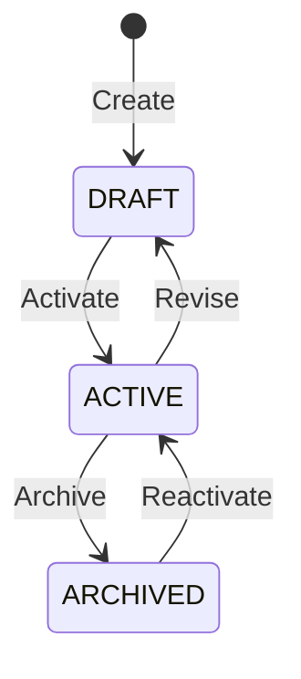
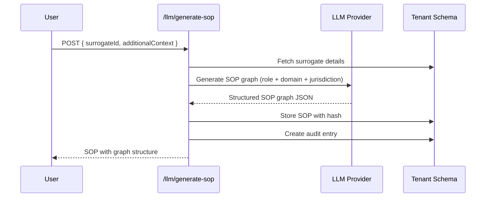
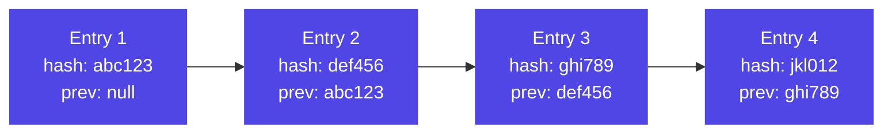

# Phase 1 — Studio

Phase 1 establishes the foundational platform: surrogate lifecycle management, LLM-powered SOP generation, role-based access control, and a tamper-evident audit trail.

---

## Surrogate CRUD

Surrogates are the core entity in Surrogate OS. Each surrogate represents a professional identity defined by:

- **Role title** (e.g., "Senior ER Nurse")
- **Domain** (e.g., "healthcare")
- **Jurisdiction** (e.g., "NHS_UK")
- **Status** (DRAFT, ACTIVE, ARCHIVED)
- **Config** (JSON object for persona-specific settings)

The surrogate lifecycle:

Endpoints: `POST/GET/PATCH/DELETE /api/v1/surrogates`

---

## SOP Generation via LLM

SOPs (Standard Operating Procedures) are structured as directed graphs, not flat documents. Each SOP contains:

- **Nodes**: Steps, decisions, escalation points
- **Edges**: Transitions between nodes with conditions
- **Metadata**: Version, hash, certification status

### Generation Flow

### Supported LLM Providers

Configured per-organization in org settings:

| Provider | Model Examples | Config Required |
|----------|--------------|-----------------|
| **Anthropic Claude** | claude-sonnet-4-20250514 | `ANTHROPIC_API_KEY` |
| **OpenAI** | gpt-4o | `OPENAI_API_KEY` |
| **Ollama** | llama3, mistral | `OLLAMA_ENDPOINT` (local) |

---

## SOP Graph Visualization

SOPs are stored as JSON graph structures with nodes and edges. The web dashboard renders these as interactive directed graphs, showing:

- Step sequence and branching logic
- Decision points with condition labels
- Escalation triggers
- Compliance checkpoints

SOPs support versioning: each update creates a new version linked to the previous via `previous_version_id`, with a content hash for integrity verification.

---

## Role-Based Access Control

Three roles with increasing privileges:

| Role | Capabilities |
|------|-------------|
| **MEMBER** | Read all data, create surrogates/SOPs, generate SOPs, create audit entries |
| **ADMIN** | All MEMBER permissions + invite users, update org settings, manage API keys/webhooks, approve proposals, remove members |
| **OWNER** | All ADMIN permissions + federation opt-in/out, delete org resources |

RBAC is enforced via the `requireRole()` middleware applied at the route level.

---

## Audit Log with Hash-Chaining

Every significant action produces an audit entry stored in the tenant schema. Entries form a cryptographic chain:

Each audit entry records:
- **Action** performed
- **Surrogate ID** (if applicable)
- **User ID** who performed it
- **Details** (JSON payload)
- **Rationale** and **confidence** score
- **Human auth** flags (required/granted)
- **Hash** of current entry and **previous_hash** for chain integrity

The chain can be verified via `GET /api/v1/audit/:id/verify` which walks the chain and confirms no entries have been tampered with.

---

## Key API Endpoints (Phase 1)

| Module | Endpoints | Count |
|--------|-----------|-------|
| Auth | register, login, refresh, invite | 4 |
| Orgs | get/update org, members, settings | 6 |
| Surrogates | CRUD + list | 5 |
| SOPs | CRUD + versions + status transitions | 5 |
| LLM | providers, generate-sop | 2 |
| Audit | create, list, verify chain | 3 |
| Stats | dashboard stats | 1 |

---

*Next: [Phase 2 — Persona Engine](/docs/features/phase2-persona)*
