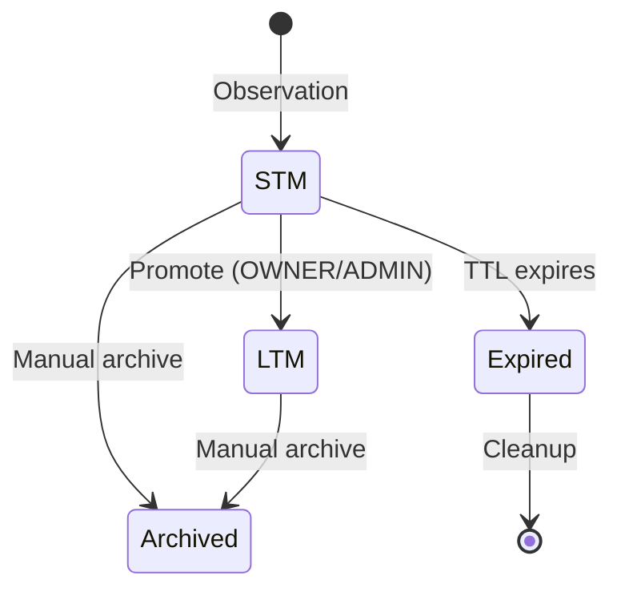
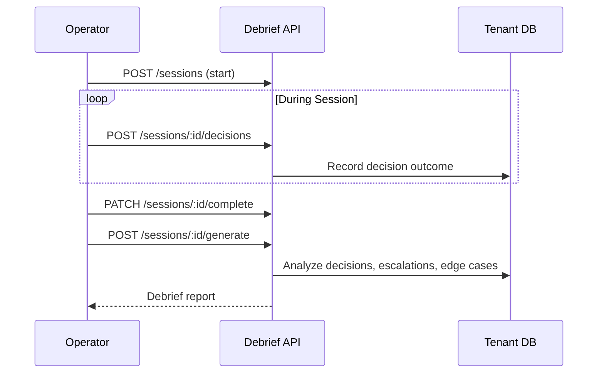
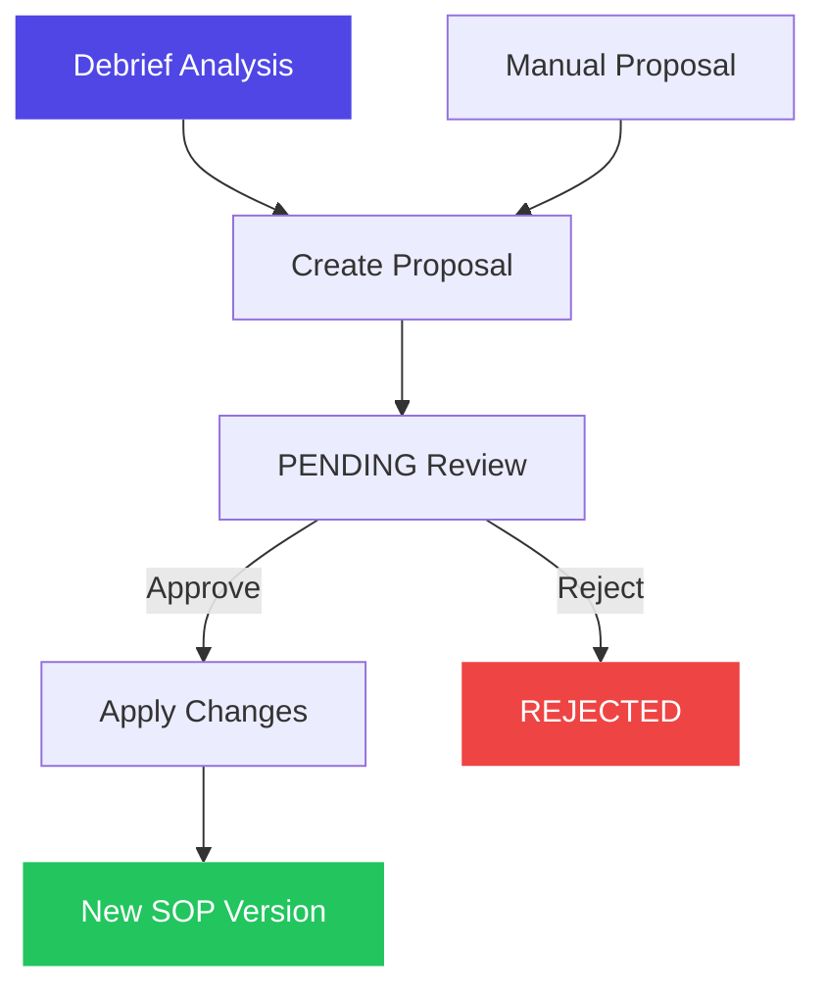

# Phase 2 Persona Engine

Phase 2 adds learning capabilities: organizations can ingest their institutional knowledge, surrogates build memory over time, sessions are debriefed for insights, and SOPs evolve through a proposal workflow.

---

## Org DNA Ingestion

Organizations upload documents (policies, handbooks, guidelines) that get chunked, embedded, and stored for semantic retrieval. This forms the organizational knowledge base.

### Pipeline

- **Chunking**: Documents are split into manageable chunks with metadata
- **Embeddings**: 1536-dimension vectors via configurable embedding provider (OpenAI, Ollama)
- **Storage**: pgvector extension in the tenant schema (`document_chunks` table)
- **Search**: Cosine similarity search across chunks for context retrieval

### Embedding Providers

Configured per-org in settings:

| Setting | Purpose |
|---------|---------|
| `embeddingProvider` | Provider name (openai, ollama) |
| `embeddingModel` | Model identifier |
| `embeddingApiKey` | API key (not required for Ollama) |
| `embeddingEndpoint` | Custom endpoint URL |

Endpoints: `POST/GET/DELETE /api/v1/org-dna/documents`, `POST /api/v1/org-dna/search`

---

## Institutional Memory (STM/LTM)

Surrogates accumulate memory entries over time, organized into two tiers:

| Type | Description | Lifecycle |
|------|-------------|-----------|
| **STM** (Short-Term Memory) | Recent observations, session context | Auto-expires, can be promoted |
| **LTM** (Long-Term Memory) | Validated patterns, institutional knowledge | Permanent until archived |

### Memory Lifecycle

Key features:
- **Observation counting**: Repeated observations increment `observation_count`, tracking pattern frequency
- **Tags**: Memory entries are tagged for categorization and retrieval
- **Pattern detection**: Analyzes a surrogate's memories to identify recurring patterns (via `/detect-patterns`)
- **Automatic cleanup**: Expired STM entries can be purged via `/cleanup`

Endpoints: `GET/POST/DELETE /api/v1/memory`, `PATCH /:id/promote`, `POST /detect-patterns`, `POST /cleanup`

---

## Shift Debrief Engine

After a surrogate completes a work session, the debrief engine analyzes what happened and generates structured insights.

### Session Workflow

### Debrief Report Contents

Each generated debrief includes:
- **Summary**: High-level session overview
- **Decisions**: All decisions made with outcomes
- **Escalations**: Cases where human intervention was needed
- **Edge cases**: Unusual situations encountered
- **Recommendations**: Suggested improvements
- **Confidence score**: Overall session confidence

### Analytics

The `/analytics` endpoint provides aggregate statistics across debriefs, optionally filtered by surrogate:
- Total sessions and debriefs
- Average confidence scores
- Escalation frequency
- Common edge case patterns

Endpoints: Session management (5), debrief generation (2), listing (3), analytics (1)

---

## SOP Self-Update Proposals

Debriefs feed into a proposal system where SOPs can evolve based on operational experience.

### Proposal Flow

Each proposal contains:
- **Current graph**: The existing SOP structure
- **Proposed graph**: The suggested modification
- **Diff**: Computed difference between current and proposed
- **Rationale**: Why the change is recommended

Two creation paths:
1. **From debrief**: `POST /proposals/from-debrief` analyzes a debrief and generates graph modifications
2. **Manual**: `POST /proposals/` with explicit proposed graph and rationale

Review requires OWNER or ADMIN role via `PATCH /proposals/:id/review`.

---

## Phase 2 API Summary

| Module | New Endpoints | Purpose |
|--------|-------------|---------|
| Org DNA | 5 | Document upload, listing, semantic search |
| Memory | 7 | STM/LTM CRUD, promotion, pattern detection, cleanup |
| Debriefs | 9 | Sessions, decisions, generation, analytics |
| Proposals | 5 | Create, review, list proposals |

---

*Previous: [Phase 1 Studio](/docs/features/phase1-studio) | Next: [Phase 3 Fleet](/docs/features/phase3-fleet)*
