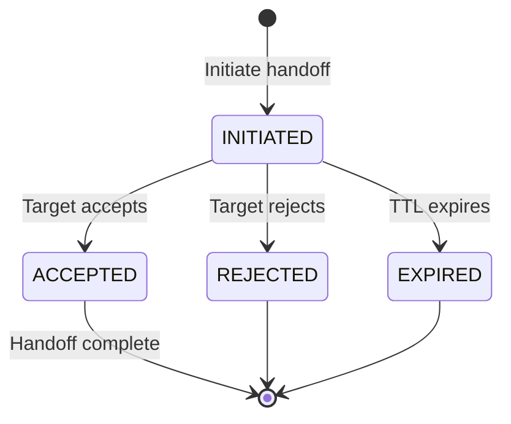
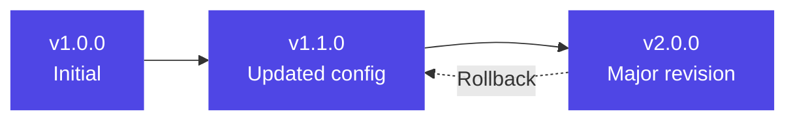
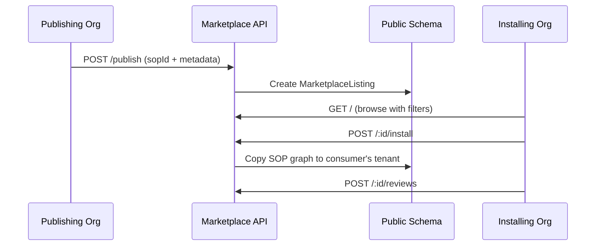
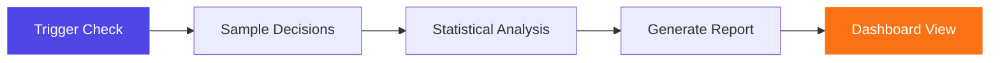

# Phase 3 — Fleet

Phase 3 scales from single surrogates to fleet operations: monitoring multiple surrogates, coordinating handoffs between agents and humans, managing reusable persona templates, sharing SOPs across organizations, and auditing for bias.

---

## Fleet Management Dashboard

The fleet module provides an operational overview of all surrogates in an organization.

### Fleet Status

`GET /api/v1/fleet/status` returns:
- Total surrogates by status (DRAFT, ACTIVE, ARCHIVED)
- Active session count
- Recent audit activity
- SOP coverage metrics

### Enriched Surrogate List

`GET /api/v1/fleet/surrogates` extends the basic surrogate list with:
- SOP count per surrogate
- Session history summary
- Health metrics (recent decisions, confidence averages)
- Filter by status, domain, jurisdiction

### Health Monitoring

`GET /api/v1/fleet/surrogates/:id/health` provides per-surrogate health:
- Decision confidence trends
- Escalation frequency
- Session duration patterns
- Anomaly indicators

### Fleet Analytics

`GET /api/v1/fleet/analytics` aggregates across the fleet:
- Organization-wide decision patterns
- Cross-surrogate performance comparison
- Resource utilization

---

## Handoff Protocol

Handoffs manage the transfer of responsibility between surrogates and humans. Three types are supported:

| Type | From | To | Use Case |
|------|------|----|----------|
| **D2D** | Surrogate | Surrogate | Shift change, specialization routing |
| **D2H** | Surrogate | Human | Escalation, complex decision |
| **H2D** | Human | Surrogate | Task delegation, resumption |

### Handoff Lifecycle

### Context Bundle

Each handoff carries a **context bundle** (JSON) containing:
- Current session state
- Active SOP position
- Decision history summary
- Relevant memory entries
- Escalation reason (if D2H)

Endpoints: `POST /handoffs`, `POST /:id/accept`, `POST /:id/reject`, `GET /handoffs`

---

## Persona Library with Versioning

Personas are reusable templates for creating surrogates. They capture a professional archetype that can be instantiated multiple times.

### Template Structure

Each persona template contains:
- **Name** and **description**
- **Domain** and **jurisdiction**
- **Base config** (JSON) defining behavior parameters
- **Tags** and **category** for discovery
- **Status** (DRAFT, PUBLISHED, ARCHIVED)
- **Version** tracking (semver)

### Version Management

- Every update creates a new version record with changelog
- Rollback to any previous version via `POST /:id/rollback`
- Export/import for sharing templates between environments

### Instantiation

`POST /personas/:id/instantiate` creates a new surrogate from a persona template, copying the base config and domain settings.

Endpoints: CRUD (5), rollback (1), instantiate (1), export/import (2), delete (1)

---

## SOP Marketplace

Organizations can publish SOPs to a cross-org marketplace and install SOPs from other organizations.

### Publishing Flow

### Features

- **Browse**: Filter by domain, category, search text, minimum rating
- **Install**: Copies the SOP graph into the installing org's tenant schema
- **Reviews**: Per-org reviews with rating (1-5) and comments
- **Pricing**: Supports free and paid listings (price + currency)
- **Metrics**: Install count, average rating, review count per listing

Endpoints: publish (1), browse (1), detail (1), install (1), reviews (2), update/delete (2)

---

## Bias Audit Dashboard

The bias module monitors surrogate decision patterns for anomalies and systematic biases.

### Bias Check Pipeline

Each bias check produces:
- **Analysis** (JSON): Statistical breakdown of decision patterns
- **Decision sample size**: Number of decisions analyzed
- **Anomalies**: Detected deviations from expected distributions
- **Recommendations**: Suggested corrective actions
- **Confidence score**: Analysis reliability

### Dashboard Endpoints

| Endpoint | Purpose |
|----------|---------|
| `POST /bias/check` | Trigger a new bias check |
| `GET /bias/checks` | List all checks with results |
| `GET /bias/distribution` | Decision distribution analysis |
| `GET /bias/anomalies` | Recent anomaly list |
| `GET /bias/dashboard` | Aggregated dashboard data |

---

## Phase 3 API Summary

| Module | New Endpoints | Purpose |
|--------|-------------|---------|
| Fleet | 5 | Status, enriched list, health, analytics, active sessions |
| Handoffs | 5 | Initiate, accept, reject, list, detail |
| Personas | 10 | CRUD, versioning, rollback, instantiate, import/export |
| Marketplace | 8 | Publish, browse, install, reviews, manage |
| Bias | 6 | Trigger, list, detail, distribution, anomalies, dashboard |

---

*Previous: [Phase 2 — Persona Engine](/docs/features/phase2-persona) | Next: [Phase 4 — Bridge](/docs/features/phase4-bridge)*
