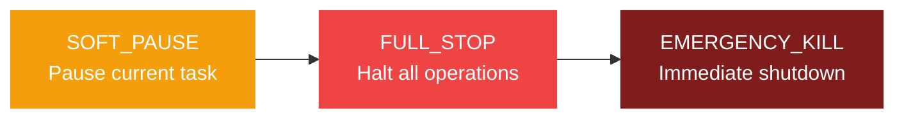
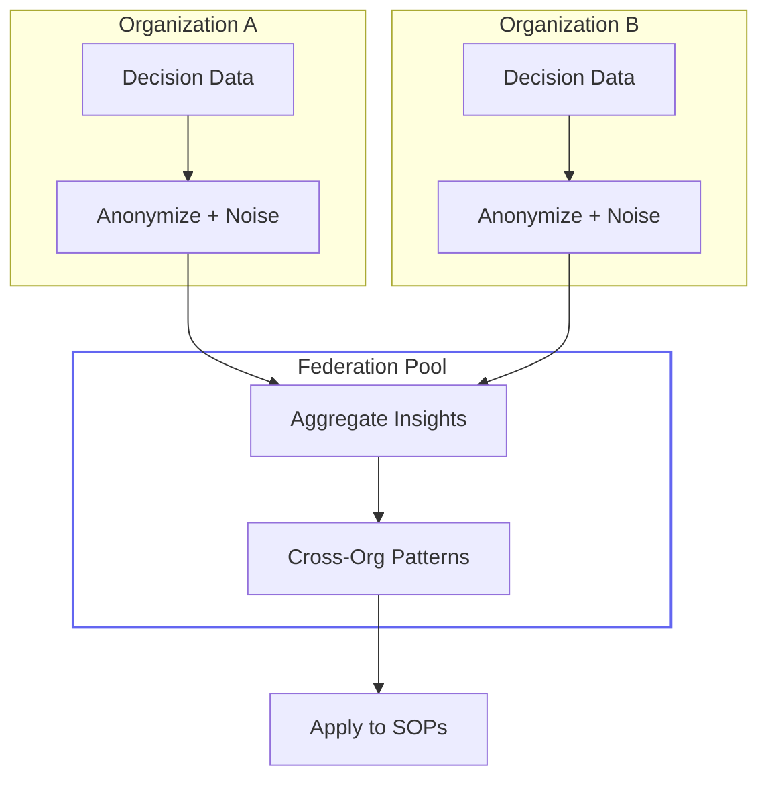
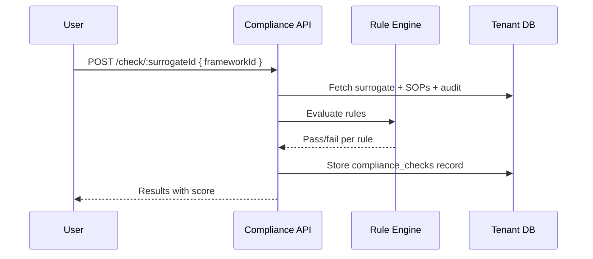
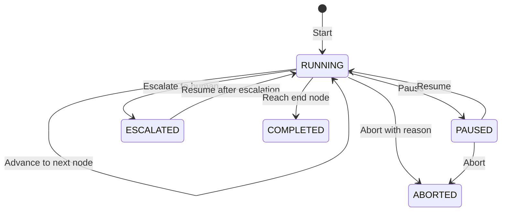

# Phase 4 Bridge

Phase 4 extends Surrogate OS beyond software agents: a humanoid SDK for physical device integration, federated learning for cross-org intelligence, a compliance certification engine, real-time SOP execution, and platform hardening for production use.

---

## Humanoid SDK

The humanoid module provides an interface abstraction layer for deploying surrogates across different physical and virtual modalities.

### Device Modalities

| Modality | Description |
|----------|-------------|
| `CHAT` | Text-based conversational interface |
| `VOICE` | Voice-enabled interaction |
| `AVATAR` | Visual avatar with voice |
| `HUMANOID` | Physical humanoid robot |

### Device Registration

Each device is registered with:
- **Name** and **modality**
- **Capabilities** array (what the device can do)
- **Hard stop configuration** (safety controls)
- **Status**: ONLINE, OFFLINE, MAINTENANCE, ERROR

### Kill Switch

Three levels of emergency control, requiring OWNER/ADMIN authorization:

Hard stop config supports:
- Heartbeat interval monitoring
- Maximum latency thresholds
- Dual-auth requirement for critical stops
- Authorized operator whitelist

### Task Translation

`POST /humanoid/translate/:sopId/:deviceId` converts SOP steps into device-specific commands based on the target modality and capabilities.

### Health Monitoring

`GET /humanoid/devices/:id/health` tracks:
- Error count and uptime
- Last heartbeat timestamp
- Current operational status

---

## Federated Learning with Differential Privacy

Organizations can opt into a federated learning pool to share anonymized decision data and gain cross-org insights.

### Architecture

### Privacy Controls

| Control | Description |
|---------|-------------|
| **Privacy budget (epsilon)** | Total differential privacy budget per org (default: 10.0) |
| **Budget tracking** | Each contribution consumes budget, preventing over-exposure |
| **Data hashing** | Contributions are hashed for deduplication |
| **Opt-in/out** | OWNER-level control via `PATCH /federation/participation` |
| **Domain scoping** | Choose which domains to participate in |

### Endpoints

| Endpoint | Purpose |
|----------|---------|
| `POST /contribute` | Submit anonymized decision data |
| `GET /contributions` | View org's contributions |
| `GET /insights` | Query the federated pool |
| `POST /apply/:sopId` | Apply insights to improve an SOP |
| `GET /privacy-report` | Budget usage and exposure report |
| `PATCH /participation` | Opt in/out (OWNER only) |
| `GET /leaderboard` | Contribution rankings |

---

## Certification and Compliance Engine

The compliance module supports verification against six regulatory frameworks:

| Framework | Domain | Jurisdiction |
|-----------|--------|-------------|
| **HIPAA** | Healthcare | US |
| **SOC 2 Type II** | General | US/Global |
| **GDPR** | Data Protection | EU |
| **ISO 27001** | Information Security | Global |
| **NHS DSP** | Healthcare | UK |
| **FCA SMCR** | Financial Services | UK |

### Compliance Check Flow

### SOP Signing

SOPs can be cryptographically signed using Ed25519:

- `POST /compliance/sign/:sopId` creates a digital signature (OWNER/ADMIN)
- `GET /compliance/verify/:sopId` verifies all signatures for an SOP
- Signatures include signer ID, public key, algorithm, and fingerprint

### Reporting

`POST /compliance/report/:surrogateId` generates a comprehensive compliance report for a surrogate against a specific framework, including pass/fail counts and scoring.

---

## Real-Time SOP Execution Engine

The execution engine enables step-by-step traversal of SOP graphs in real time.

### Execution Lifecycle

### Key Capabilities

- **Graph traversal**: Navigate node-by-node through SOP graphs
- **Decision recording**: Each node advance records the decision and context
- **Branching**: `GET /:id/transitions` returns available paths from current node
- **Timeline**: `GET /:id/timeline` shows the full decision history
- **Escalation**: `POST /:id/escalate` pauses execution and alerts a human
- **Pause/Resume**: Execution can be paused and resumed without losing state

### Execution State

Each execution tracks:
- Current node ID in the SOP graph
- Visited nodes history
- Decisions made at each step
- Session linkage
- Start/completion timestamps

---

## Platform Hardening

Phase 4 adds production-grade infrastructure capabilities:

### API Keys

Scoped API keys for programmatic access:
- Create with name, scopes, and optional expiry
- Key rotation without downtime
- Revocation with audit trail
- Key hash stored (never plain text), prefix for identification

### Webhooks

Event-driven integrations:
- Register webhooks with URL and event subscriptions
- HMAC-SHA256 signed payloads
- Delivery log with status codes and retry counts
- Test endpoint for validation

### Notifications

In-app notification system:
- Per-user notifications with type, title, message
- Read/unread tracking
- Bulk mark-as-read
- Unread count endpoint for badges

---

## Phase 4 API Summary

| Module | New Endpoints | Purpose |
|--------|-------------|---------|
| Humanoid | 7 | Device CRUD, kill switch, task translation, health |
| Federation | 7 | Contribute, insights, apply, privacy, participation |
| Compliance | 8 | Check, frameworks, sign, verify, history, status, report |
| Executions | 10 | Start, advance, pause, resume, abort, escalate, timeline |
| API Keys | 4 | Create, list, revoke, rotate |
| Webhooks | 6 | Register, list, update, delete, deliveries, test |
| Notifications | 4 | List, unread count, mark read, mark all read |

---

*Previous: [Phase 3 Fleet](/docs/features/phase3-fleet) | [Architecture Overview](/docs/architecture/overview)*
