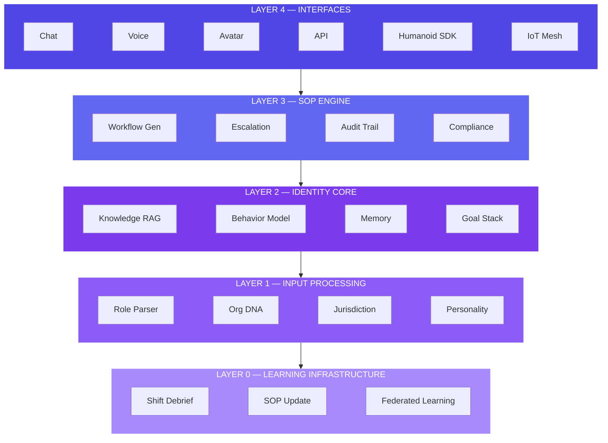

# What is Surrogate OS?

<span className="badge--alpha">v2.0-alpha</span>

**Surrogate OS is a professional identity engine.** You give it a role. It synthesizes a complete professional identity — SOPs, knowledge base, behavioral model, compliance layer — and deploys it as an operational AI agent.

The same identity can run as a chat agent, voice assistant, video avatar, autonomous background agent, or — on roadmap — a **humanoid robot**.

```
INPUT:  "Senior ER Nurse, Royal London Hospital, NHS UK"

OUTPUT: A fully-operational clinical AI with 147 auto-generated SOPs,
        NHS-compliant behavior model, BNF drug database, NICE guideline
        adherence, SBAR communication protocols, and 24/7 availability.
        Deployable via chat, voice, or humanoid platform.
```

---

## What It Is NOT

- ❌ Not a general-purpose chatbot
- ❌ Not an RPA tool
- ❌ Not a search engine or document summarizer
- ❌ Not a replacement for human judgment in high-stakes decisions

## The Defining Difference

When a hospital deploys Surrogate OS as a clinical aide, the system doesn't *assist* with nursing tasks — it *operates as a nurse*, with all the procedural rigor, domain knowledge, communication protocols, and escalation judgment that entails.

**The surrogate is not a tool the nurse uses. The surrogate is the nurse when the nurse cannot be there.**

---

## Architecture at a Glance



---

## Persona Library

| ID | Persona | Domain | Regulatory Framework |
|----|---------|--------|---------------------|
| P-001 | Clinical Aide (ER Nurse) | Healthcare | NHS / NICE / NMC |
| P-002 | Clinical Aide (ICU) | Healthcare | NHS / NICE / GMC |
| P-003 | Legal Buddy (M&A) | Law | SRA / Law Society / SEC |
| P-005 | Site Foreman (HSE) | Construction | OSHA / ISO 45001 / CDM |
| P-006 | CFO Shadow | Finance | IFRS / GAAP / SOX / FCA |
| P-007 | Teaching Twin (SPED) | Education | IDEA / ESSA / Ofsted |
| P-009 | Elder Companion | Care | CQC / Skills for Care |
| P-010 | Mars Mission Specialist | Deep Space | NASA Flight Rules / ESA ECSS |

---

## Deployment Modes

The same professional identity can be instantiated across six modes:

| Mode | Interface | Primary Use Cases |
|------|-----------|------------------|
| Chat | Text, web/mobile/API | Knowledge work, documentation |
| Voice Agent | Phone, smart speaker | Healthcare (bedside), field ops |
| Avatar | Video conferencing, kiosk | Telemedicine, education |
| Embedded Copilot | Within existing software | EMR, legal PM, engineering tools |
| Autonomous Agent | Background operation | Monitoring, routine workflow |
| Humanoid Platform | Physical robot body | Field ops, care, hazardous environments |

---

## Next Steps

- **[Quick Start](/docs/getting-started/quick-start)** — Generate your first surrogate
- **[Vision & Thesis](/docs/vision/thesis)** — Understand the central thesis
- **[Architecture](/docs/technical/architecture)** — Deep dive into the technical stack
