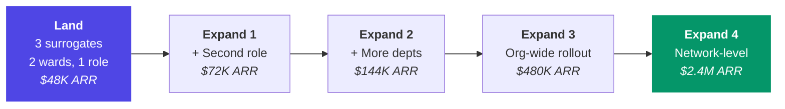

# Go-To-Market Strategy

> *"You don't sell a platform. You prove a point of pain so acutely that the customer sells it to themselves."*

**Sequence:** Prove it → Land it → Expand it → Reference it → Scale it.

---

## Phase 1: The Beachhead (Months 1-12)

### Target Vertical: Clinical Healthcare (NHS UK + Private UAE)

**Why here first:**
- Highest urgency (clinical staff shortages are a crisis)
- Clearest ROI (72% of nurse time is admin)
- Most structured SOPs exist (NICE, NHS protocols)
- UAE is innovation-forward with faster regulatory timelines
- NHS is globally credible opens every other health system

### Target Accounts

| Tier | Targets | Ask | Win Criterion |
|------|---------|-----|---------------|
| **A: Innovation Leaders** | 3 NHS Trusts with existing AI pilots | Free 90-day supervised pilot | Published case study |
| **B: UAE Private** | 5 hospitals (Cleveland Clinic AD, Mediclinic, etc.) | Paid pilot at $24K (6mo, 3 surrogates) | Contract renewal + referral |
| **C: NHS Networks** | 12 Integrated Care Boards | Enterprise contract ($96K-$144K/yr) | Multi-year renewal + expansion |

### Pilot Design (90 days)

| Week | Activity |
|------|---------|
| **1-2** | Deploy: ingest org SOPs, generate clinical surrogate, expert validate, deploy to 3 wards |
| **3-12** | Supervised operation: documentation, triage support, drug checks, handover reports. Human reviews every decision. |
| **13** | Outcome assessment: admin time saved, incidents, staff NPS, ROI calculation |
| **14** | Case study publication (BMJ, Health Service Journal) |

:::tip The case study is worth more than the revenue
One published NHS case study with quantified outcomes is worth $2-3M in pipeline acceleration.
:::

---

## Phase 2: Expansion (Months 12-24)

### Land-and-Expand Model

### Vertical Expansion

| Vertical | Timing | Entry Point | Hook |
|----------|--------|-------------|------|
| **Legal** | Month 12-18 | Magic Circle firms | "Associates spend 60% on due diligence" |
| **Finance** | Month 18-24 | Tier 1 bank compliance | "Drowning in regulatory change monitoring" |

---

## Phase 3: Platform (Months 24-36)

### SOP Marketplace

- Professional associations create and sell certified SOP packs
- 30% platform take on every pack sold
- Certification fee: $8K-$40K per pack
- Flywheel: More packs → More verticals → More deployments → Better corpus

### Partner Strategy

| Partner Type | Examples | Structure |
|-------------|----------|-----------|
| System Integrators | Accenture Health, Deloitte, KPMG | Reseller + implementation, 20-30% margin |
| Workflow Platforms | Epic, Clio, Salesforce Health Cloud | Technology partnership, native integration |
| Humanoid Hardware | Figure AI, Boston Dynamics, Apptronik | OEM cognitive license, revenue share |

---

## Messaging Architecture

### The Customer's Problem (Not Our Solution)

| Persona | Message |
|---------|---------|
| **Clinical Director** | "Your nurses spend 72% of their shift on documentation. That's clinical time not spent on patients." |
| **Managing Partner** | "Your best associates are drowning in due diligence at midnight." |
| **CFO** | "You close the month in 8 days. Best-in-class is 2." |

### One-Sentence Value Props

| Persona | Value Prop |
|---------|-----------|
| Clinical Director | "Your nurses, fully supported 24/7." |
| Managing Partner | "Junior associate work, senior associate speed." |
| CFO | "Month-end in one day. Every month." |
| CRO | "Every decision logged. Every SOP followed. Every time." |

### What We Never Say

- ❌ "AI assistant" positions us as a chat tool
- ❌ "Copilot" Microsoft owns this, implies dependency
- ❌ "Automation" implies RPA, fear of replacement
- ❌ "Replace doctors" kills deals immediately
- ✅ "Professional identity engine"
- ✅ "Extends your team without headcount"

---

## Sales Motion (Target: 90 days)

| Week | Activity | Goal |
|------|---------|------|
| 1 | Discovery call | Identify specific workflow to pilot |
| 2 | Technical deep-dive with live SOP generation | "Better than what we have documented" |
| 3 | Stakeholder mapping | Navigate governance, IT, procurement |
| 4-6 | Proof of concept with real workflows | Governance committee asks "when can we start?" |
| 7-10 | Commercial + security review | SOC 2 report, DPA, security questionnaire |
| 11-12 | Contract + deployment planning | Sign, plan 4-week deployment |
| 13+ | Deploy, measure, expand | |

---

## Year 1 Revenue Target

| Scenario | Enterprise | Studio | Pilots | Total ARR |
|----------|-----------|--------|--------|-----------|
| **Realistic** | 8 × $72K | 25 × $3.6K | 3 × $24K | **$738K** |
| **Optimistic** | 15 × $96K | 60 × $3.6K | 2 × $240K | **$2.1M** |

Year 1 is about **proof, not revenue**. Two published case studies are worth more than $2M ARR for the trajectory.

---

*Next: [Risk Register →](/docs/strategy/risk)*
