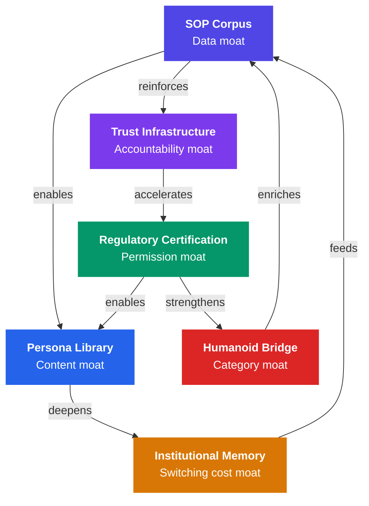

# Defensibility Architecture

> *"A business without a moat is a loan to your competitors."*

---

## The Question Every Investor Asks

*"OpenAI could build this in six months. Why won't they?"*

The technology is not what makes this defensible. The answer is a layered architecture of **six compound moats** each independently significant, collectively making the position nearly impossible to replicate.

---

## Moat 1: The SOP Corpus

**The irreplaceable data asset.** Every deployment generates data about professional decisions in practice. After 12 months across 500 networks: millions of clinical decision points, hundreds of thousands of escalation events, thousands of edge cases.

This data doesn't exist anywhere. It is generated exclusively by active deployment.

```
YEAR 1:  500 deployments   →  corpus enables better SOPs
YEAR 2:  2,000 deployments →  corpus 4× richer
YEAR 3:  8,000 deployments →  corpus is industry-standard
YEAR 5:  50,000 deployments → corpus has no peer
```

A competitor starting in Year 3 faces a 2-year corpus gap. They cannot buy their way out. They need trust → which requires corpus → which requires deployment. **The circle is closed against them.**

---

## Moat 2: Regulatory Certification

**The permission moat.** Getting certified for NHS deployment takes 6-12 months of clinical governance review. FCA requires SMCR documentation and model risk governance. These require time, relationships, and track record.

```
2025:  First NHS pilot approved
2026:  NHS framework published (shaped by our pilot data)
2027:  FCA guidance references our audit trail standard
2028:  FDA issues clinical AI surrogate guidance
2030:  New entrant faces 5 years of frameworks built around our architecture
```

**The certification moat is a time moat. Time cannot be purchased.**

---

## Moat 3: Institutional Memory

**The switching cost moat.** Every month a surrogate operates, it learns org-specific knowledge not in any manual team communication preferences, vendor nuances, regulatory interpretations, resolved edge cases.

| Duration | Switching Cost |
|----------|---------------|
| Year 1 | $240K |
| Year 3 | $1.8M |
| Year 5 | $6.4M+ |

This is the same dynamic that makes Epic dominant in hospital EHR but our moat is about operational knowledge, which is even harder to transfer.

---

## Moat 4: Trust Infrastructure

**The accountability moat.** In high-stakes contexts, adoption bottlenecks on: "What happens when it goes wrong?"

Our answer is architectural: immutable audit trail, documented rationale, certified SOP, clear accountability chain. This is what allows a hospital's legal team, insurance company, and regulator to approve deployment.

**No competitor can copy this by writing code.** It is the result of years of engagement with regulated industry stakeholders.

---

## Moat 5: The Persona Library

**The content moat.** Each persona requires 6-12 months of domain expert engagement clinical governance review, standards analysis, pilot deployment, certification.

By Year 3: 100+ certified personas across 12 verticals = **300+ person-years** of domain expert engagement. A competitor starts from zero.

---

## Moat 6: The Humanoid Bridge

**The category moat.** Figure, Boston Dynamics, Tesla, Apptronik they have extraordinary physical platforms. They have **no professional identity layer**.

When Figure AI wants to sell robots to hospital networks, they need a certified clinical cognitive layer. The company with the certified SOP corpus and NHS governance relationships is the only viable partner.

**Category creators who define standards are almost impossible to displace.**

---

## Compound Defensibility



Each moat makes the others stronger. **A competitor must defeat all six simultaneously.**

---

## The OpenAI Question Answered

OpenAI could build the SOP generator and the persona interface. What they **cannot** do:

1. **Accumulate the deployment corpus** They sell an API, not hospital deployments
2. **Build the regulatory relationships** Zero relationship with NHS, FCA, IAEA
3. **Develop domain expertise** They are a technology company, not a domain company
4. **Earn institutional trust** Cannot be manufactured
5. **Enter humanoid market credibly** No hardware relationships or physical deployment track record

**We are not racing OpenAI. We are building what OpenAI makes possible.**

---

*Next: [Go-To-Market Strategy →](/docs/strategy/gtm)*
