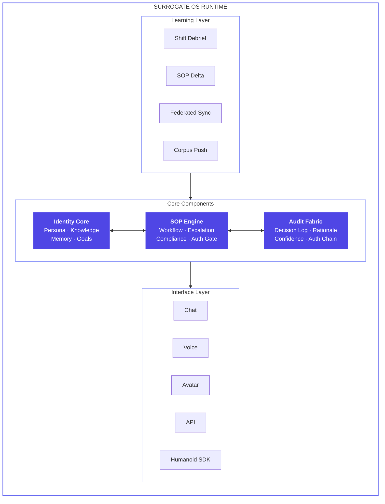
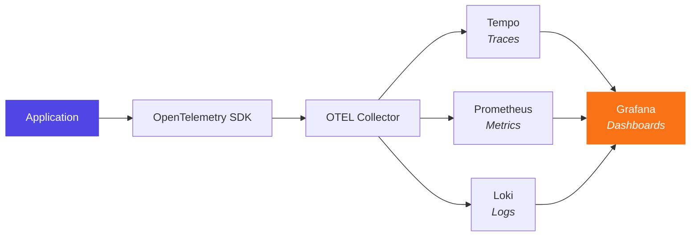

# System Architecture

> *"Architecture is the set of decisions that are hardest to change later. Get these right first."*

---

## Engineering Philosophy

Three principles govern every technical decision:

1. **Identity is the primitive, not the query.** Every system is optimized around the persistent professional identity.
2. **The SOP is executable, not descriptive.** SOPs are structured operational graphs, not documents.
3. **The audit trail is primary, not secondary.** The audit trail IS the system. Every other component writes to it.

---

## Runtime Architecture



---

## Tech Stack

### Core Runtime

| Component | Technology | Rationale |
|-----------|-----------|-----------|
| **LLM Backbone** | Anthropic Claude API | Enterprise, SOC2, HIPAA eligible |
| **Vector DB** | Weaviate | Self-hosted per org for data sovereignty |
| **Memory Store** | Redis Enterprise | Encrypted, per-org isolation |
| **Audit DB** | PostgreSQL | Append-only tables + cryptographic chain |
| **Orchestration** | LangGraph | Stateful agent workflows |
| **SOP Graph Engine** | Custom | Built on directed graph primitives |
| **Corpus Retrieval** | Custom RAG | Jurisdiction-aware routing |

### Application Stack

| Component | Technology | Details |
|-----------|-----------|---------|
| **Backend** | Fastify v5 + TypeScript | Lightweight, schema-validated HTTP |
| **Frontend** | Next.js 15 (App Router) | React + Tailwind CSS v4 |
| **ORM** | Prisma v6 | PostgreSQL 16, schema-based multi-tenancy |
| **Auth** | JWT + bcrypt | Access (15m) + Refresh (7d) tokens |
| **Shared** | Zod schemas | Shared types, validation, constants |
| **Build** | Turborepo | Monorepo with build cache |

### Infrastructure

| Component | Technology | Purpose |
|-----------|-----------|---------|
| **Database** | PostgreSQL 16 | Primary store, multi-tenant schemas |
| **Tracing** | OpenTelemetry + Tempo | Distributed traces |
| **Logging** | Pino + Loki | Structured JSON logs |
| **Metrics** | Prometheus | Scraping and alerting |
| **Dashboards** | Grafana | Unified observability UI |
| **Deployment** | Kubernetes | Org-specific namespaces |
| **Encryption** | AES-256 at rest, TLS 1.3 in transit | Zero-trust |
| **Key Mgmt** | HashiCorp Vault | Org-specific key hierarchies |

---

## Multi-Tenancy Architecture

The API implements **schema-based multi-tenancy**:

```typescript
// Each organization gets its own PostgreSQL schema
class TenantManager {
  async executeInTenant<T>(
    orgId: string,
    operation: (client: PrismaClient) => Promise<T>
  ): Promise<T> {
    const schema = `tenant_${orgId}`;
    await this.client.$executeRaw`SET search_path TO ${schema}`;
    return operation(this.client);
  }
}
```

Key properties:
- **Schema isolation** Each org gets its own PostgreSQL schema
- **BYOK encryption** Org holds the encryption key, not us
- **Vector DB namespaces** Per-org partitions in Weaviate
- **Auth middleware** Decorates every request with tenant context
- **Zero cross-org access** Impossible by architecture, not just policy

---

## Observability Stack

All infrastructure runs via Docker Compose for local development:

```yaml
# infra/docker-compose.yml provides:
services:
  postgres:        # Port 5432 Primary database
  otel-collector:  # Port 4317/4318 Telemetry ingestion
  tempo:           # Port 3200 Trace storage
  loki:            # Port 3100 Log aggregation
  prometheus:      # Port 9090 Metrics scraping
  grafana:         # Port 4000 Dashboards
```

### Trace Flow



Every SOP traversal, audit entry, and tenant operation generates distributed traces with full context propagation.

---

## Compliance Infrastructure

| Standard | Scope | Status |
|----------|-------|--------|
| **HIPAA** | BAA-eligible infrastructure, 7-year audit retention | Roadmap |
| **SOC 2 Type II** | Annual audit | Year 1 |
| **GDPR** | Data residency, right-to-erasure (excluding audit trail) | Active |
| **ISO 27001** | Certification | Year 1-2 |
| **NHS DSP** | Data Security and Protection Toolkit | Active |
| **FCA SMCR** | Algorithmic decision logging | Roadmap |

---

## The MVP Architecture

```
INPUT:   Role title + org type + jurisdiction (text form)
PROCESS: SOP generation pipeline → persona hydration → chat interface
OUTPUT:  A deployed chat surrogate with generated SOPs and basic audit trail

✅ IN SCOPE:                    ❌ LATER:
  Role parsing                    Voice interface
  SOP auto-generation             Avatar
  Chat interface                  Humanoid SDK
  Basic audit trail               Federated learning
  Human escalation                Fleet consciousness
  Org DNA ingestion               Live SOP self-update
  Tool use (web, docs)            IoT integration
  Session memory                  Institutional memory v2
```

**MVP Success Criteria:** A domain expert says: *"This is good enough to work from. With one hour of review, this could be deployed in a real professional context."*

---

*Deep dive: [Identity Core](/docs/technical/identity-core) · [SOP Engine](/docs/technical/sop-engine) · [Audit Fabric](/docs/technical/audit-fabric)*
