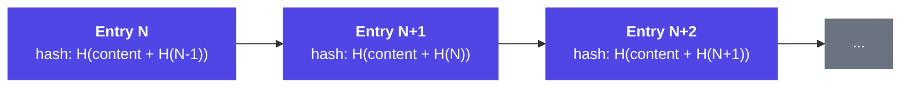

# Audit Fabric

Every other component writes to the Audit Fabric. It is the **source of truth**.

---

## Audit Entry Schema

```typescript
interface AuditEntry {
  // Identity
  entry_id: string;                    // Globally unique, immutable
  surrogate_id: string;
  organization_id: string;
  deployment_id: string;

  // Timing
  timestamp: ISO8601;
  session_id: string;
  shift_id: string;

  // What happened
  entry_type: AuditEntryType;
  sop_reference: string;               // Which SOP, which node
  action_taken: ActionDescriptor;
  action_rationale: RationaleTree;     // Full reasoning chain

  // Confidence
  confidence_score: number;            // 0.0–1.0
  confidence_components: {
    knowledge_retrieval: number;
    sop_alignment: number;
    context_clarity: number;
    precedent_match: number;
  };

  // Authorization
  human_auth_required: boolean;
  human_auth_record: AuthRecord | null;

  // Outcome
  immediate_outcome: OutcomeDescriptor;
  follow_up_required: boolean;
  escalation_triggered: boolean;

  // Integrity
  hash: string;                        // SHA-256 of entry content
  previous_hash: string;               // Chain linkage (blockchain-style)
  signature: string;                   // Platform cryptographic signature
}
```

---

## Chain Integrity

The audit trail uses a **blockchain-style chained hash structure**. Every entry references the hash of the previous entry. Tampering with any entry invalidates all subsequent hashes.



If **Entry N** is modified, its hash changes which invalidates Entry N+1, which invalidates Entry N+2, and so on. Tampering is detected immediately on any verification check.

This provides **mathematical proof** that the audit trail has not been altered the technical foundation for the regulatory accountability claim.

---

## Audit Log Example

```json
{
  "auditId": "aud_7f3c9a12",
  "timestamp": "2025-06-15T14:32:01.847Z",
  "surrogateId": "sg_f8a2b1c9",
  "action": {
    "type": "clinical_assessment",
    "sopReference": "SOP-010",
    "output": "ESI Level 2 Immediate triage required",
    "confidence": 0.991
  },
  "decision": {
    "autonomousAction": true,
    "humanAuthRequired": false,
    "rationale": "Confidence 99.1% exceeds MEDIUM threshold of 95%"
  },
  "compliance": {
    "framework": "NHS_NICE",
    "validated": true,
    "violations": []
  },
  "signature": "sha256:7f3c9a12...",
  "immutable": true
}
```

---

## Implementation

The current implementation uses SHA-256 chained hashes:

```typescript
// apps/api/src/lib/crypto.ts
import { createHash } from 'crypto';

export function computeAuditHash(
  previousHash: string,
  action: string,
  timestamp: string,
  surrogateId: string
): string {
  const content = `${previousHash}:${action}:${timestamp}:${surrogateId}`;
  return createHash('sha256').update(content).digest('hex');
}
```

Key properties:
- **Append-only** Audit entries are never modified or deleted
- **Cryptographic chain** Each entry references the previous hash
- **Tamper detection** Any modification invalidates all downstream entries
- **Per-tenant storage** Audit entries scoped to tenant schema
- **7-year retention** HIPAA/compliance requirement

---

*Next: [API Reference](/docs/technical/api-reference) · [Safety Architecture](/docs/technical/safety)*
