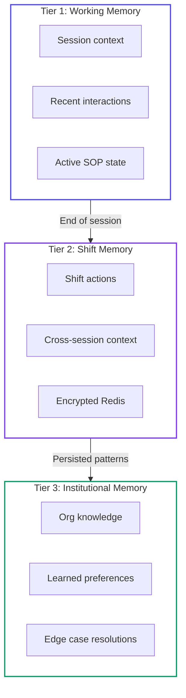

# Identity Core

The Identity Core is the persistent state object that defines a surrogate. It is not a prompt — it is a structured data object with multiple subsystems.

---

## Persona Object Schema

```typescript
interface SurrogatePersona {
  id: string;                          // Unique surrogate identifier
  role: ProfessionalRole;              // Parsed role definition
  identity: IdentityProfile;           // Behavioral calibration
  knowledge: KnowledgeIndex;           // Domain RAG configuration
  memory: MemoryFabric;               // Short + long term memory
  sop_set: SOPGraph[];                // Active SOP collection
  authorization_scope: AuthScope;     // What this surrogate can do
  audit_config: AuditConfiguration;   // Logging behavior
  deployment_context: DeploymentCtx;  // Org, jurisdiction, interface
  meta: PersonaMeta;                  // Version, certification status
}

interface ProfessionalRole {
  title: string;                       // "Senior ER Nurse"
  seniority: SeniorityLevel;
  domain: IndustryDomain;
  sub_domain: string;                  // "Level 2 Trauma"
  organization_type: OrgType;          // "NHS Trust"
  jurisdiction: Jurisdiction[];        // ["UK", "NHS", "NICE"]
  certification_requirements: string[];
}

interface IdentityProfile {
  communication_style: CommStyle;
  assertiveness_level: number;         // 0.0–1.0
  empathy_bias: number;               // 0.0–1.0
  risk_tolerance: number;             // 0.0–1.0
  escalation_threshold: number;       // Confidence below → escalate
  language_register: LanguageRegister;
  cultural_context: CulturalProfile;
}
```

---

## Knowledge Index Architecture

The Knowledge Index defines which corpora to query and how to weight them:

```typescript
interface KnowledgeIndex {
  primary_corpus: CorpusReference[];
  secondary_corpus: CorpusReference[];
  org_specific: OrgCorpusReference[];
  retrieval_strategy: RetrievalConfig;
  confidence_thresholds: {
    act: number;          // Above this → execute
    advise: number;       // Above this → recommend
    escalate: number;     // Below this → escalate
    refuse: number;       // Below this → refuse and flag
  };
}

// Example: Clinical surrogate corpus configuration
const clinicalCorpora: CorpusReference[] = [
  { id: "nice_guidelines", weight: 0.95, jurisdiction: "UK" },
  { id: "bnf_formulary",   weight: 0.99, jurisdiction: "UK" },
  { id: "who_protocols",   weight: 0.80, jurisdiction: "GLOBAL" },
  { id: "pubmed_clinical", weight: 0.70, jurisdiction: "GLOBAL" },
  { id: "nhs_policies",    weight: 0.90, jurisdiction: "UK_NHS" },
];
```

---

## Memory Fabric



A three-tier memory system:

### Tier 1: Working Memory (session scope)
- Current task context, recent interactions, active SOP state
- **TTL:** End of session
- **Storage:** In-process vector cache
- **Size:** ~8K tokens active context

### Tier 2: Shift Memory (deployment instance scope)
- Everything in current shift/deployment period
- Cross-session but not cross-deployment
- **Storage:** Encrypted Redis cluster
- **Retention:** 30 days post-session

### Tier 3: Institutional Memory (org-surrogate scope)
- Long-term organizational knowledge, learned preferences, edge case resolutions
- Persistent across deployments, specific to org-persona pair
- **Storage:** Encrypted persistent vector DB (per-org partition)
- **Retention:** Duration of deployment + 7 years (compliance)

---

## Persona Versioning

Personas are versioned like software:

| Type | Example | What Changes |
|------|---------|-------------|
| **Major** | v1 → v2 | Significant behavioral model or compliance changes |
| **Minor** | v1.2 → v1.3 | SOP updates, knowledge base expansions |
| **Patch** | v1.2.1 → v1.2.2 | Bug fixes, compliance corrections |

---

*Next: [SOP Engine](/docs/technical/sop-engine) · [Audit Fabric](/docs/technical/audit-fabric)*
