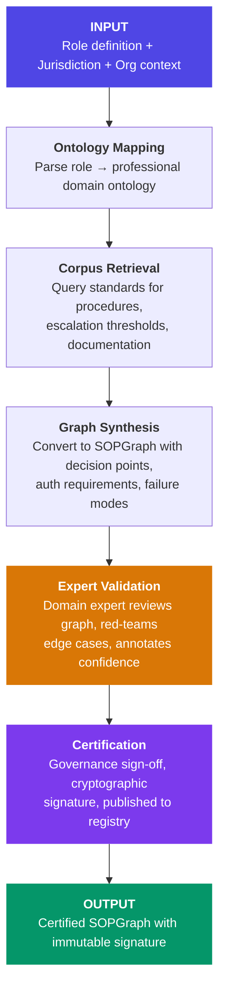
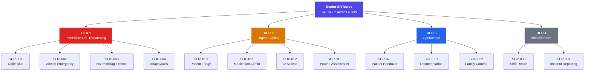
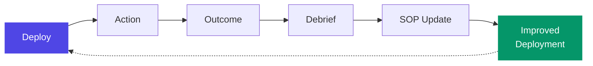

# SOP Engine

The SOP Engine is the core differentiator. It is not a prompt template. It is a **structured operational graph execution system**.

---

## SOP Graph Structure

```typescript
interface SOPGraph {
  id: string;                          // "SOP_CLINICAL_TRIAGE_v2.4.1"
  version: SemanticVersion;
  certification_status: CertStatus;
  jurisdiction: Jurisdiction[];
  trigger_conditions: TriggerSet;
  entry_point: SOPNode;
  nodes: Map<string, SOPNode>;
  edges: SOPEdge[];
  exit_conditions: ExitCondition[];
  escalation_paths: EscalationPath[];
  failure_modes: FailureMode[];
  audit_requirements: AuditRequirement[];
}

interface SOPNode {
  id: string;
  type: NodeType;
  description: string;
  confidence_requirement: number;
  human_auth_required: boolean;
  auth_level: AuthorizationLevel;
  timeout: Duration;
  on_success: string;                  // Next node ID
  on_failure: EscalationPath;
  on_timeout: EscalationPath;
  audit_level: AuditLevel;
}

type NodeType =
  | "INFORMATION_GATHER"   // Collect data (vitals, docs, etc.)
  | "ASSESSMENT"           // Evaluate and score
  | "DECISION"             // Choose between paths
  | "ACTION_DIGITAL"       // Digital action (send, log, calculate)
  | "ACTION_PHYSICAL"      // Physical action (requires higher auth)
  | "CHECKPOINT"           // Human review point
  | "ESCALATION"           // Hand off to human
  | "DOCUMENTATION"        // Generate record
  | "HANDOVER"             // Transfer to another surrogate or human
```

---

## Auto-Generation Pipeline



### Example: Senior ER Nurse SOP Tree



---

## Runtime SOP Traversal

During operation, the surrogate traverses the SOP graph in real time:

```python
class SOPTraversal:
    def execute_node(self, node: SOPNode, context: ExecutionContext) -> NodeResult:

        # 1. Check confidence
        confidence = self.assess_confidence(node, context)
        if confidence < node.confidence_requirement:
            return self.escalate(node, context, reason="LOW_CONFIDENCE")

        # 2. Check authorization requirement
        if node.human_auth_required:
            auth = self.request_authorization(node, context)
            if not auth.granted:
                return self.escalate(node, context, reason="AUTH_DENIED")
            self.audit.log_authorization(node, auth)

        # 3. Execute node action
        try:
            result = self.execute_action(node, context)
            self.audit.log_action(node, result, confidence)
            return NodeResult(success=True, next_node=node.on_success)

        except ActionException as e:
            self.audit.log_failure(node, e)
            return self.traverse_failure_mode(node, e, context)

        except TimeoutException:
            self.audit.log_timeout(node)
            return self.traverse_escalation(node.on_timeout, context)
```

---

## The Learning Loop



Every action is logged with context, compared against SOP-specified outcomes, and analyzed for drift. Systematic deviations that produce better outcomes become SOP update candidates — reviewed and approved by humans before implementation.

### Shift Debrief System

```python
class ShiftDebrief:
    def run(self, shift_record: ShiftRecord) -> DebriefReport:
        # 1. SOP Adherence Analysis
        sop_delta = self.compute_sop_delta(executed, prescribed)

        # 2. Deviation Classification
        # ESCALATION | EDGE_CASE | ORG_NUANCE | POTENTIAL_ERROR

        # 3. Outcome Correlation
        # Positive outcome correlation → flag for SOP enhancement

        # 4. Edge Case Extraction
        # Cases where SOP was insufficient → feed to SOP update queue

        # 5. Institutional Learning
        # Org-specific patterns → add to institutional memory

        # 6. Federated Contribution (anonymized)
        # Stripped of org-identifying information → global corpus
```

---

*Next: [Audit Fabric](/docs/technical/audit-fabric) · [API Reference](/docs/technical/api-reference)*
